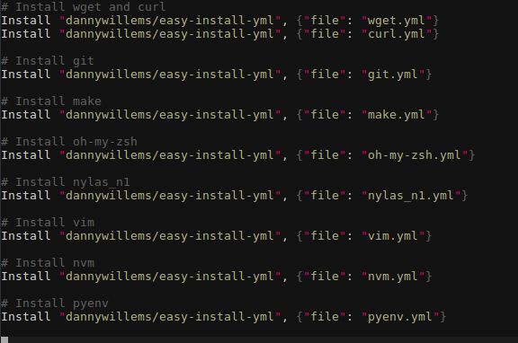

# Manage and install your softwares easily!

[](https://travis-ci.org/dannywillems/easy-install) [](https://ci.appveyor.com/project/dannywillems/easy-install/branch/master)

Install softwares on multiple computers, environments or operating systems takes
lots of time and it's very boring.

This repository contains a script which allows you to install all softwares you
need by writing only a single file, independently of your operating system.

See [here](https://github.com/dannywillems/easy-install-yml) for a list of YAML
files to use.



## Installation

*Depends on python, pip and git*

You can install *easy-install.py* by using cURL:

```Shell
curl -o- https://raw.githubusercontent.com/dannywillems/easy-install/master/easy-install.sh | bash
```
or Wget
```Shell
wget -qO- https://raw.githubusercontent.com/dannywillems/easy-install/master/easy-install.sh | bash
```

It will clone the easy-install repository into ```~/.easy-instal```, install script
dependencies with *pip*.

After that, you need to add ~/.easy-install to your PATH by adding at the end in your
bashrc or zshrc file:
```
export PATH=$HOME/.easy-install:$PATH
```

## Usage

**It is supposed neovim and nvm have a .easy-install.rc file in their github
directory, which is not the case for the moment. See below for the current
use.**

If you want to install [nvm](https://github.com/creationix/nvm) and
[neovim](https://github.com/neovim/neovim), you only need to write in a file (default is ```~/.easy-install.rc```) the lines

```vim
# This is a comment, not mandatory
# Install neovim from github repository
Install "neovim/neovim"
# Install nvm from github repository
Install "creationix/nvm"
```

and execute with
```Shell
easy-install.py
```

If you don't use ```~/.easy-install.rc```, you can use, after installing,
```Shell
easy-install.py your_configuration_file
```

The script will parse the YAML file ```.easy-install.yml``` in each repository and executes the command in this YAML file.

This command supposes nvm and neovim repositories contain a YAML file known ```.easy-install.yml``` (see below). If not, you can specify the YAML file in the repository. This method allows to have a single repository containing all your YAML files (and it's become simple dotfiles). The ```.easy-install.rc``` file becomes

```vim
# Install neovim by using the YAML file neovim.yml contained in https://github.com/dannywillems/easy-install-yml
Install "dannywillems/easy-install-yml", {"file": "neovim.yml"}
# Install pyenv by using the YAML file pyenv.yml contained in https://github.com/dannywillems/easy-install-yml
Install "dannywillems/easy-install-yml", {"file": "pyenv.yml"}
```

**Be careful: it is double quote, even in option (ie file and the value). Need
to be improved by modifying the REGEX in source code**

## Basic usages / .easy-install.rc file

If the software has a github repository with a ```.easy-install.yml``` at the
root, you can use
```
Install 'user/repo'
```
This command will download the ```.easy-install.yml``` file and executes the
commands.

If there is not a ```.easy-install.yml``` file at the root, you can specify a
path to the YAML file. For example,
[easy-install-yml](https://github.com/dannywillems/easy-install-yml) contains a
some YAML files. If you want to install [Nylas
N1](https://nylas.com/), you can
use
```
Install "dannywillems/easy-install-yml", {"file": "nylas_n1.yml"}
```

**Be careful: it is simple quote from user/repo and there are double quote in
option (ie file and the value). Need to be improved by modifying the REGEX in
source code**

## How to make your software compatible with easy-install?

*See [easy-install-yml](https://github.com/dannywillems/easy-install-yml) for examples.*

easy-install use a YAML configuration file named ```.easy-install.yml``` located in the github repository of your software.
This configuration file contains a list of commands to execute to install your software.

A simple YAML file is
```YAML
description: description of your software or the YAML file contents

install:
  # If make must be used to compile and install, on all platforms
  - make
  - make install

depends:
  # Your software has make as dependencies and you want to install it without
  using another yaml file.
  - debian:
    - sudo apt-get install -y make

depends-easy:
  # You can install dependencies using other easy-install files. Here, install
  make using the make easy-install file.
  - 'Install "dannywillems/easy-install-yml", {"file": "make.yml"}'

after_install:
  # You can also add some after_install commands
  - echo "Make has been installed."
```

In resume, your YAML file contains:
* A *description* node describing the YAML file or the software.
* An *install* node containing a list of commands (with possible
  dependencies about the OS, see the operating systems list below).
* A *depends* node containing a list of dependencies.
* A *depends-easy* node which allows you to install dependencies with another
  easy-install YAML file. **Recommended** because it avoids to list all platform
  dependencies. Note that single quote are mandatory because PyYAML returns an
  error if they are not present.
* A *after_install* node which allows you to execute a list of command after the
  installation.

This YAML file is useful to
* execute different commands depending on the platform. It's interesting to
  install softwares using the package manager.
* install dependancies. If your softwares needs make to be installed, you can
  specify ```make``` as a dependancies.
* execute commands after the installation.

### Operating systems list

Here the list of targets you need to use to write a YAML file to target the
specific platform. If it's in **bold**, it means it's not yet implemented.

Short        | OS target
-------------|----------
debian       | Ubuntu, Debian
arch         | **Archlinux**
fedora       | **Fedora**
bsd          | **BSD**
mac          | **Mac OS X**
win          | **Windows**

## To-do

- [ ] Improve the code: it was fast coded, improvements must be done.
- [ ] Improve REGEX used to parse configuration files.
- [ ] Add more operating system dependencies, other than Ubuntu (need for first
  version).
- [ ] Add other host than github.
- [ ] Catch error
- [x] After install commands in a *after_install* node.
- [ ] Add architecture dependencies. For the moment, default is 64bits.
- [ ] Add version dependencies. For example, some ppa must be added for Ubuntu 14.04
  but not for Ubuntu 16.04.
